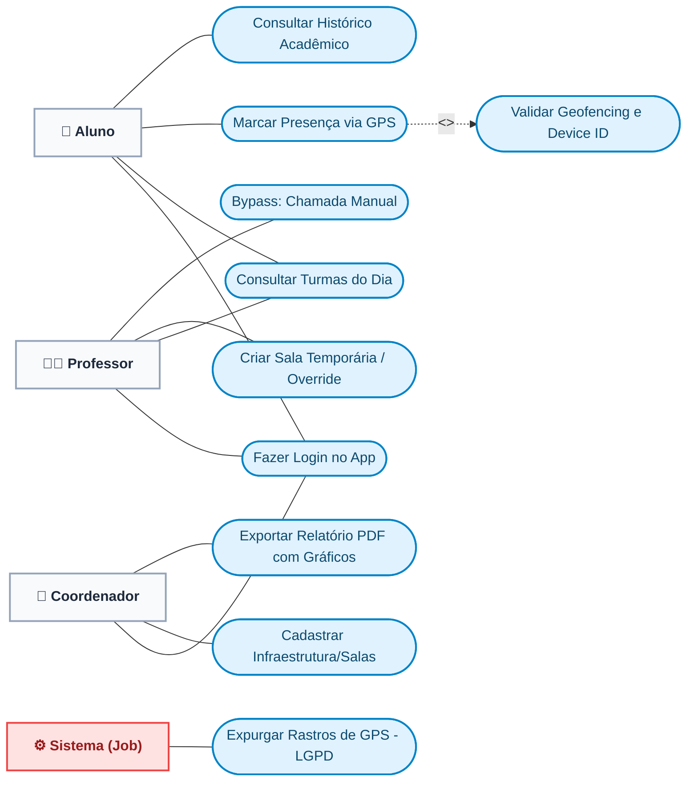

# Diagrama de Casos de Uso - GeoClass

O **Diagrama de Casos de Uso (UML)** é essencial na monografia porque ele ilustra de forma simples e direta quais ações cada Ator (Usuário) pode realizar no sistema.

Abaixo, utilizei a formatação do Mermaid para desenhar os "bonequinhos" (Atores) à esquerda e as "bolinhas" (Casos de Uso) à direita, incluindo as famosas relações de `<<include>>`. Copie o código e cole no [Mermaid Live Editor](https://mermaid.live/) para exportar a imagem para o seu TCC!

## 1. Código do Diagrama (Mermaid)

---

## 2. Descrição dos Casos de Uso (Para escrever no TCC)

Em uma monografia formal, depois de colocar a imagem do diagrama, você precisa listar os principais casos de uso em texto. Copie estes exemplos para o seu trabalho:

### CDU-01: Marcar Presença via GPS
* **Ator Principal:** Aluno
* **Descrição:** Permite que o aluno registre sua presença na aula atual do dia.
* **Pré-condições:** O aluno deve estar logado e deve haver uma aula ativa no horário atual.
* **Fluxo Principal:** O aluno clica no botão; o sistema capta sua localização exata e seu Device ID; o sistema confirma a presença.
* **Includes:** Inclui obrigatoriamente o caso de uso `Validar Geofencing e Device ID`.

### CDU-02: Validar Geofencing e Device ID (Automático)
* **Ator Principal:** Sistema
* **Descrição:** Ação invisível ao usuário, acionada (via `<<include>>`) toda vez que um ponto é batido. O sistema checa via Fórmula de Haversine se o aluno está no raio da sala e bloqueia caso o ID do hardware do celular já tenha sido usado por outro aluno naquele mesmo dia.

### CDU-03: Criar Sala Temporária
* **Ator Principal:** Professor
* **Descrição:** Permite ao professor alterar a sala de aula dinamicamente no aplicativo.
* **Fluxo Principal:** O professor seleciona a turma e escolhe a nova sala. O sistema altera o polígono de validação georreferenciada para todos os alunos daquela turma exclusivamente naquele dia.

### CDU-04: Exportar Relatório PDF
* **Ator Principal:** Coordenador
* **Descrição:** Permite ao coordenador gerar documentos executivos das taxas de evasão e de faltas.
* **Fluxo Principal:** O coordenador escolhe o nível de detalhamento (Semestre, Turma ou Aluno) e clica em exportar. O sistema gera uma árvore DOM em HTML e desenha gráficos analíticos diretamente em um arquivo PDF nativo.

### CDU-05: Expurgar Rastros de GPS
* **Ator Principal:** Sistema (Job Autônomo)
* **Descrição:** Uma rotina agendada que roda de madrugada (CRON). Ela rastreia presenças mais velhas que 6 meses e limpa as colunas sensíveis (latitude e longitude), anonimizando os dados para cumprir regras de Privacidade (LGPD).
