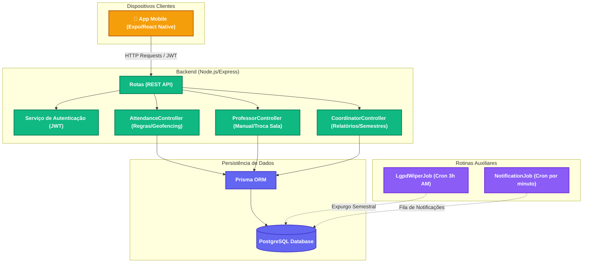

# 📍 GeoClass - Análise Técnica Detalhada do Projeto

Esta é uma análise arquitetural, funcional e de segurança completa do projeto **GeoClass**, com base no código-fonte, configurações e documentações fornecidas.

---

## 🏗️ 1. Arquitetura Geral do Sistema

O GeoClass é estruturado em uma arquitetura cliente-servidor com separação total de responsabilidades. O ecossistema é mantido em TypeScript de ponta a ponta:

---

## 💾 2. Modelagem do Banco de Dados (Prisma Schema)

O banco de dados relacional utiliza o PostgreSQL e possui o mapeamento gerido pelo Prisma ORM. A modelagem garante a consistência ACID e o histórico acadêmico:

### Entidades Principais
* **`User`**: Armazena dados de Alunos, Professores e Coordenadores (definidos pela enum `Role`). Contém o `ra` (registro acadêmico) exclusivo para alunos e o timestamp `privacy_terms_accepted_at` (LGPD).
* **`Class`**: Representa as turmas/disciplinas. Guarda a localização padrão da sala (`latitude`, `longitude`), o raio máximo de validação (`radius_meters`), o professor responsável, a grade horária (`schedule_time`) e a meta total de aulas previstas (`total_classes`).
* **`Enrollment`**: Tabela associativa de relacionamento N:N entre `User` (Aluno) e `Class`, com chave única composta `[student_id, class_id]`.
* **`Attendance`**: Registro diário de frequência. Contém o status (`PRESENTE`, `ATRASADO`, `FALTA`), `device_id` (vínculo de dispositivo do dia), coordenadas da batida (`student_latitude`, `student_longitude`) e flags de tipo (`is_remote`, `manual_attendance`). Possui chave única composta `[student_id, class_id, date]`.
* **`TemporaryClassLocation`**: Permite alterar temporariamente a sala (e coordenadas geográficas) de uma disciplina em uma data específica. Útil em realocações dinâmicas pelo professor.
* **`Room`**: Cadastro base da infraestrutura física do campus (Bloco/Sala/Laboratório) contendo nome e coordenadas geográficas estáticas.
* **`Notification`**: Histórico de alertas gerados para o usuário.

---

## 🔒 3. Mecanismos Centrais de Segurança e Regras de Negócio

### A. Geofencing Server-Side (Fórmula de Haversine)
Diferente de sistemas que validam a distância localmente (suscetíveis a manipulações em dispositivos com jailbreak ou fake GPS), o GeoClass processa a validação trigonométrica no backend:
1. O app captura as coordenadas através do `expo-location` (alta precisão).
2. O backend busca as coordenadas da sala de aula (ou da sala temporária, caso haja realocação no dia).
3. Aplica-se a **Fórmula de Haversine** para calcular a distância física em linha reta levando em conta a esfericidade da Terra.
4. É aplicada a compensação de margem de precisão (`distance - gpsAccuracy <= targetRadius`), prevenindo falsos negativos devido a perdas de sinal GPS.

### B. Device Binding (Combate à Fraude de Dispositivo)
Para impedir que um aluno colete dispositivos de colegas para marcar presença por eles:
1. O aplicativo móvel extrai uma impressão digital de hardware (`AndroidId` ou `IosIdForVendorAsync`).
2. Ao realizar o registro de presença, o backend armazena o `device_id` no banco.
3. Se outro usuário tentar bater ponto utilizando o mesmo `device_id` no mesmo dia, a API bloqueia a requisição com um erro de tentativa de fraude (`403 Forbidden`).
4. Um professor ou coordenador tem permissão especial para redefinir o vínculo (`resetDeviceBinding`) caso o aluno comprove ter trocado de aparelho ou precise de liberação justificada.

### C. Assinatura Digital e Sincronização Offline
Se o aluno estiver sem internet na sala de aula:
1. O aplicativo executa uma verificação prévia de Geofencing localmente.
2. Sendo válida a posição, ele cria um pacote contendo `{classId, lat, lon, timestamp, deviceId}`.
3. Esse pacote é assinado localmente com SHA-256 usando uma chave secreta (`OFFLINE_SECRET`) compartilhada.
4. O registro é enfileirado na memória persistente do dispositivo (`SecureStore`).
5. Assim que a rede se restabelece, o app envia o pacote assinado à API. O backend recalcula a assinatura com base nos mesmos parâmetros e a chave do servidor, aceitando a data e hora retroativas somente se a assinatura for válida e se a batida tiver ocorrido no horário oficial da aula (respeitando a tolerância de 15 minutos).

---

## ⚖️ 4. Governança e Privacidade (Compliance com LGPD)

Em estrito alinhamento com a **Lei Geral de Proteção de Dados (LGPD)**, o GeoClass implementa a política de *Privacy by Design*:
* **Aceite de Termos**: O usuário é obrigado a revisar e aceitar os termos de consentimento e privacidade antes de usar o sistema (RF01 / `privacy_terms_accepted_at`).
* **Anonimização Periódica (`LgpdWiperJob`)**: Um cron job é disparado diariamente às 03:00 da manhã. Ele busca no banco todos os registros de presença (`Attendance`) com data superior a 6 meses e **nula de forma definitiva** os campos de geolocalização (`student_latitude`, `student_longitude`) e assinatura de hardware (`device_id`). A presença escolar é mantida, mas o histórico de rastreamento é destruído.

---

## 📬 5. Rotinas Automatizadas (Jobs)

Além do expurgo LGPD, o backend roda um job de **processamento de notificações** a cada minuto (`NotificationJob`):
* **Lembrete aos alunos**: Se uma turma inicia no horário corrente, notifica os alunos matriculados para realizarem a chamada.
* **Fechamento ao professor**: 15 minutos após o início da aula, calcula o total de alunos presentes e notifica o professor com o sumário.
* **Evasão**: 
  - Notifica o aluno se sua taxa de faltas em alguma disciplina passar de 20%.
  - Notifica os coordenadores se a média geral de faltas de um aluno superar 25%.
  - Notifica os coordenadores se o absenteísmo médio de uma turma superar 30%.
  - Todas as notificações de evasão contam com um limitador (throttle) para rodar apenas uma vez a cada 7 dias por usuário.

---

## 📂 6. Estrutura e Organização do Código

O projeto está dividido de forma modular e clara:

### Backend (`geoclass-api`)
* [schema.prisma](file:///e:/projetos/tg/geoclass/geoclass-api/prisma/schema.prisma): Definições de modelo e relacionamento.
* [server.ts](file:///e:/projetos/tg/geoclass/geoclass-api/src/server.ts): Inicialização do Express, Middlewares de CORS, JSON e agendamentos cron.
* [routes/index.ts](file:///e:/projetos/tg/geoclass/geoclass-api/src/routes/index.ts): Mapeamento de endpoints públicos/privados separados por perfis acadêmicos.
* [controllers/](file:///e:/projetos/tg/geoclass/geoclass-api/src/controllers/):
  - [AttendanceController.ts](file:///e:/projetos/tg/geoclass/geoclass-api/src/controllers/AttendanceController.ts): Core do cálculo Haversine e validação de dispositivo.
  - [AuthController.ts](file:///e:/projetos/tg/geoclass/geoclass-api/src/controllers/AuthController.ts): Gestão de login via JWT e aceite de termos.
  - [ProfessorController.ts](file:///e:/projetos/tg/geoclass/geoclass-api/src/controllers/ProfessorController.ts): Chamada manual, realocação de sala e reset de hardware.
  - [CoordinatorController.ts](file:///e:/projetos/tg/geoclass/geoclass-api/src/controllers/CoordinatorController.ts): Consolidação de dados e cadastros.

### Frontend (`geoclass-mobile`)
* [App Navigator](file:///e:/projetos/tg/geoclass/geoclass-mobile/src/navigation/AppNavigator.tsx): Orquestrador de rotas nativas com base no perfil de usuário (Aluno, Professor, Coordenador).
* [useStudentHome.ts](file:///e:/projetos/tg/geoclass/geoclass-mobile/src/hooks/useStudentHome.ts): Hook customizado que controla a solicitação de GPS nativo, validação de fake GPS (`location.mocked`) e lógica de fallback offline.
* [useOfflineQueue.ts](file:///e:/projetos/tg/geoclass/geoclass-mobile/src/hooks/useOfflineQueue.ts): Gerencia o armazenamento persistente offline e sincronização em lote ao recuperar conexão.

---

## 🛠️ 7. Observações Técnicas / Sugestões de Melhoria

1. **`SecureStore` no Web**: No hook [useOfflineQueue.ts](file:///e:/projetos/tg/geoclass/geoclass-mobile/src/hooks/useOfflineQueue.ts), a função `SecureStore.getItemAsync` é chamada diretamente. Em ambiente Web (onde o projeto roda com mocks), o `expo-secure-store` pode disparar exceções por não ser suportado nativamente sem verificação. Recomenda-se aplicar um tratamento condicional usando `Platform.OS === 'web'` semelhante ao existente no `authStorage.ts`.
2. **Total de Aulas no Dashboard**: A tela [StudentController.ts](file:///e:/projetos/tg/geoclass/geoclass-api/src/controllers/StudentController.ts) utiliza uma lógica estática de 20 aulas passadas para compor o percentual de faltas do aluno. Para evoluir do MVP, esse cálculo pode ser atrelado ao número real de registros de `Attendance` gerados para a turma no semestre letivo.
