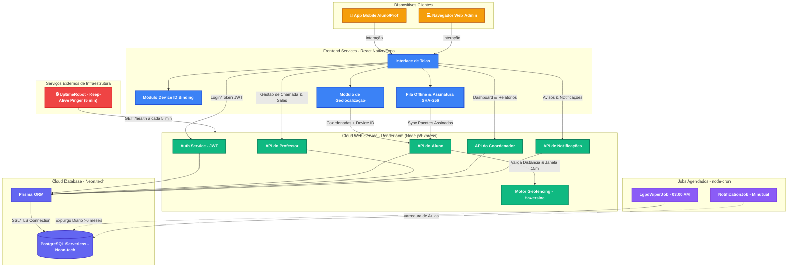

# Arquitetura Visual do Sistema GeoClass

Para apresentar a arquitetura de forma visual e profissional, você pode utilizar o **Mermaid**, que é uma linguagem de diagramação baseada em texto que gera gráficos automaticamente. O Mermaid é suportado nativamente pelo GitHub, Notion, Obsidian e várias outras plataformas.

Abaixo está o código do diagrama da arquitetura completa do GeoClass.

## Diagrama da Arquitetura



---

## Como usar este diagrama:

1. **Uso Imediato (Markdown):** Se você for colocar isso no README do GitHub do seu projeto, basta colar o bloco de código acima. O GitHub vai renderizar a imagem visualmente!
2. **Para Exportar como Imagem no [Mermaid Live Editor](https://mermaid.live):** 
   - ⚠️ **ATENÇÃO AO COPIAR:** No editor do Mermaid Live, **NÃO cole a primeira linha ```` ```mermaid ```` nem a última linha ```` ``` ````**.
   - Cole **apenas o conteúdo interno**, começando na palavra `flowchart TD` e indo até a última linha `CronNotif -.->|Varredura de Aulas| DB`.
   - Clique em **"Save as PNG"** ou **"Save as SVG"** no canto inferior direito para baixar a imagem em alta qualidade e colocar no seu documento/apresentação.

## O que este diagrama demonstra (para explicar na sua apresentação):
- **Infraestrutura em Nuvem Integrada:** Exibe a API hospedada no **Render.com** conectada ao banco de dados PostgreSQL Serverless no **Neon.tech** via Prisma ORM.
- **Prevenção de Cold-Start (Keep-Alive):** O **UptimeRobot** realiza pings automáticos a cada 5 minutos na rota `/health` para evitar que a API no Render entre em hibernação no plano gratuito.
- **Resiliência Offline:** O módulo da **Fila Offline com Assinatura Criptográfica SHA-256** garante que chamadas registradas sem internet sejam enviadas com segurança assim que a conexão for estabelecida.
- **Segurança & Antifraude no Backend:** Mostra como o `Device ID` e o `Motor Geofencing` (Haversine + Janela de 15 minutos) são validados diretamente no servidor.
- **Privacidade & Compliance LGPD:** Demonstra as rotinas agendadas `LgpdWiperJob` (expurgo de geodados antigos) e `NotificationJob` operando em segundo plano.
