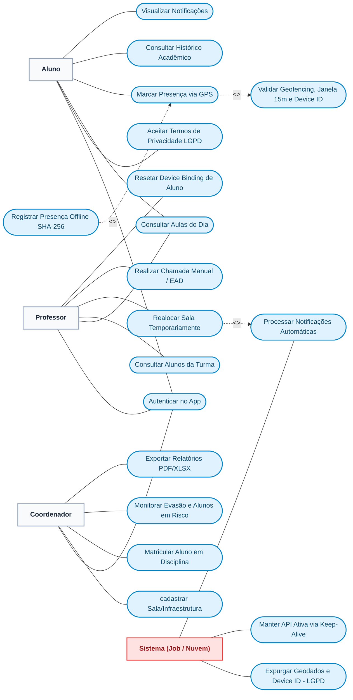

# Diagrama de Casos de Uso - GeoClass

O **Diagrama de Casos de Uso (UML)** é essencial na monografia/TCC pois ilustra de forma clara e estruturada quais interações cada Ator (Usuário/Sistema) executa no ecossistema do GeoClass.

O diagrama a seguir utiliza a notação **Mermaid**, categorizando os atores (Aluno, Professor, Coordenador e Sistema Autônomo) e os relacionamentos de `<<include>>` (inclusão obrigatória) e `<<extend>>` (extensão condicional).

---

## 1. Diagrama de Casos de Uso (Mermaid UML)

---

## 2. Especificação Detalhada dos Casos de Uso (Para TCC/Monografia)

### CDU-01: Autenticar no App
* **Atores:** Aluno, Professor, Coordenador
* **Descrição:** Autenticação de usuários via e-mail e senha com geração de token de sessão JWT segregando permissões por papel (*Role-Based Access Control*).

### CDU-02: Aceitar Termos de Privacidade (LGPD)
* **Ator Principal:** Aluno
* **Descrição:** Apresentação e coleta do consentimento expresso do aluno para o processamento de geolocalização e captura de identificadores de hardware.

### CDU-04: Marcar Presença via GPS
* **Ator Principal:** Aluno
* **Descrição:** Registro de presença em um clique para a aula atual do dia. Captura latitude, longitude e `Device ID`.
* **Pré-condições:** Estar logado, dentro da janela de horário de aula e permissão de GPS concedida.
* **Includes:** `CDU06: Validar Geofencing, Janela 15m e Device ID`.

### CDU-05: Registrar Presença Offline (SHA-256)
* **Ator Principal:** Aluno
* **Descrição:** Caso não haja conexão com a internet, o app valida o Geofencing localmente e enfileira um pacote criptográfico assinado com SHA-256 (`timestamp` + `deviceId` + `secret`), enviando automaticamente à API ao reconectar.
* **Extends:** `CDU04: Marcar Presença via GPS`.

### CDU-06: Validar Geofencing, Janela 15m e Device ID (Automático)
* **Ator Principal:** Sistema (Backend API)
* **Descrição:** Algoritmo server-side que calcula a distância pela Fórmula de Haversine ajustada por margem de GPS, bloqueia registros fora da tolerância de 15 minutos de aula e impede a reutilização do mesmo `Device ID` para matrículas distintas no mesmo dia.

### CDU-09: Realocar Sala Temporariamente
* **Ator Principal:** Professor
* **Descrição:** Permite ao professor mudar a sala de aula para o dia corrente. O sistema valida se a nova sala está disponível e dispara uma notificação aos alunos matriculados.
* **Includes:** `CDU18: Processar Notificações Automáticas`.

### CDU-10: Realizar Chamada Manual / EAD
* **Ator Principal:** Professor
* **Descrição:** Permite o lançamento manual da lista de presenças/faltas para aulas remotas (EAD) ou em casos excepcionais de imprevisto tecnológico dos alunos.

### CDU-11: Resetar Device Binding de Aluno
* **Atores:** Professor, Coordenador
* **Descrição:** Permite desvincular o `Device ID` registrado no dia para determinado aluno que tenha trocado de aparelho ou sofrido falha de hardware.

### CDU-13: Cadastrar Infraestrutura / Salas
* **Ator Principal:** Coordenador
* **Descrição:** Cadastro de blocos, laboratórios e salas de aula informando o nome e as coordenadas geográficas de centróide (latitude e longitude).

### CDU-14: Matricular Aluno em Disciplina
* **Ator Principal:** Coordenador
* **Descrição:** Vincula um aluno cadastrado a uma turma/matéria ativa em determinado semestre letivo.

### CDU-15: Monitorar Evasão e Alunos em Risco
* **Ator Principal:** Coordenador
* **Descrição:** Dashboard analítico que calcula a taxa global de faltas por semestre e lista os alunos ordenados por maior percentual de ausências (risco de reprovação por frequência `< 75%`).

### CDU-16: Exportar Relatórios PDF / XLSX
* **Ator Principal:** Coordenador
* **Descrição:** Geração e download de relatórios consolidados em `.XLSX` (Excel) e documentos `.PDF` com gráficos interativos de acompanhamento de presenças.

### CDU-17: Expurgar Geodados e Device ID (LGPD)
* **Ator Principal:** Sistema (Job Agendado `LgpdWiperJob`)
* **Descrição:** Rotina automatizada `node-cron` que roda diariamente às 03:00 AM. Anonimiza as colunas de geolocalização e `device_id` em registros de presença com mais de 6 meses de antiguidade.

### CDU-19: Manter API Ativa via Keep-Alive
* **Ator Principal:** Sistema (Pinger `UptimeRobot`)
* **Descrição:** Serviço externo que dispara requisições HTTP `GET /health` a cada 5 minutos para a API no Render.com, impedindo que o container hiberne no plano gratuito.
