# Fluxos de Utilização (User Journeys) - GeoClass

Este documento mapeia detalhadamente o passo a passo de todas as interações de cada perfil de usuário (**Aluno**, **Professor**, **Coordenador**) e das rotinas autônomas de **Infraestrutura** no ecossistema **GeoClass**.

Para ilustrar o caminho de ponta a ponta (desde a ação da interface móvel/web até a resposta e persistência no banco de dados), utilizam-se **Diagramas de Sequência (UML)** na notação **Mermaid**.

---

## 1. Fluxos do Aluno

O perfil de Aluno engloba o ciclo completo desde a autenticação com aceite dos termos da LGPD, passando pelo registro de presença via GPS (online/offline), até a consulta de histórico acadêmico e alertas.

### 1.1 Autenticação, Consentimento LGPD & Consulta de Aulas do Dia
O aluno realiza a autenticação por e-mail/senha, valida o aceite dos termos de privacidade e visualiza a grade de aulas marcadas para o dia corrente.

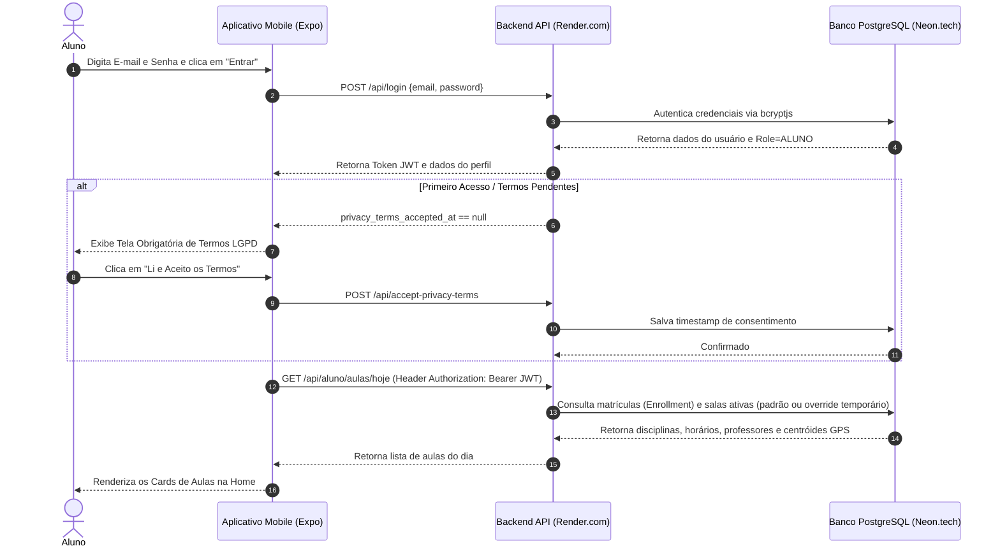

---

### 1.2 Registro de Presença com Geofencing & Antifraude (Online)
Fluxo principal de check-in onde a API valida a localização por Haversine, a janela estrita de 15 minutos e a colisão de ID do hardware.

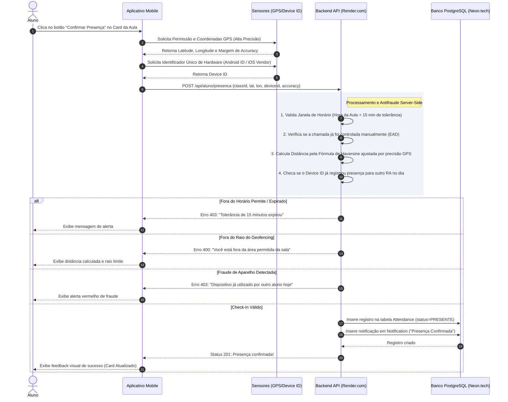

---

### 1.3 Fila Offline Criptografada (SHA-256) & Sincronização Automática
Garante a resiliência do registro quando o aluno estiver sem conexão de internet no momento da chamada.

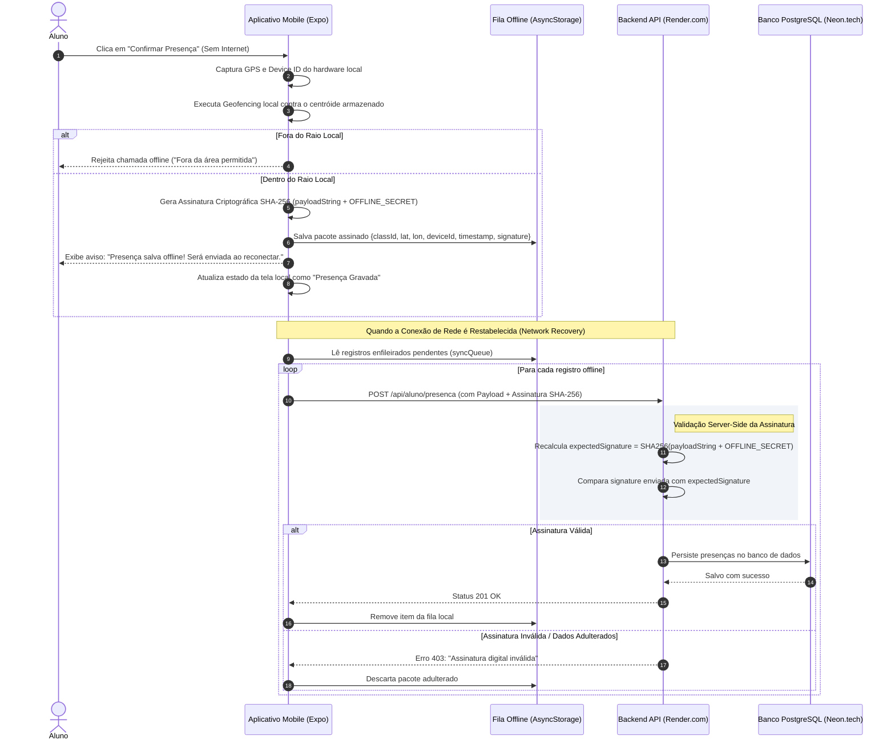

---

### 1.4 Dashboard de Frequência, Histórico Acadêmico & Notificações
Permite ao aluno acompanhar seu percentual de frequência por matéria, consultar seu histórico de chamadas e visualizar notificações.

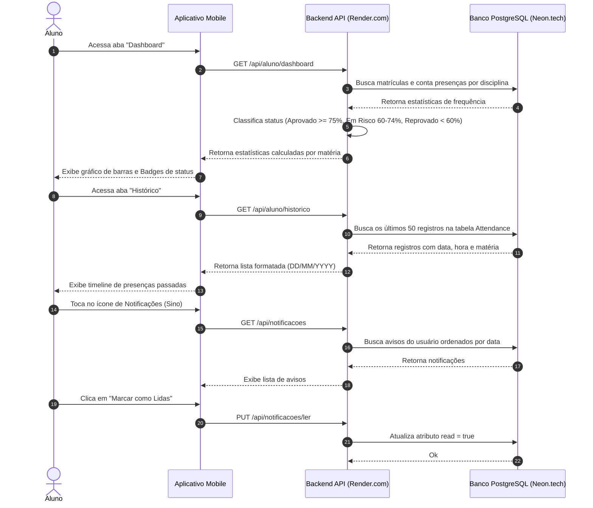

---

## 2. Fluxos do Professor

O perfil de Professor possui autonomia operacional para gerenciar suas turmas no dia a dia acadêmico através de 4 fluxos principais:

### 2.1 Acompanhamento de Turmas & Chamada em Tempo Real
O professor visualiza as turmas do dia e monitora os alunos que efetuam check-in via GPS em tempo real.

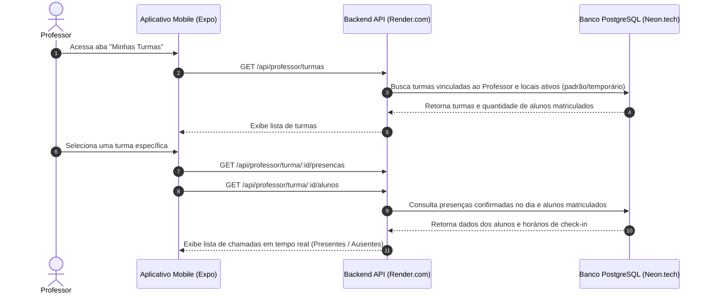

---

### 2.2 Troca Temporária de Sala & Notificação em Tempo Real
Permite ao professor alterar a sala de aula dinamicamente (ex: ida a um laboratório). O sistema realiza dupla verificação de conflitos de agenda e notifica todos os alunos matriculados.

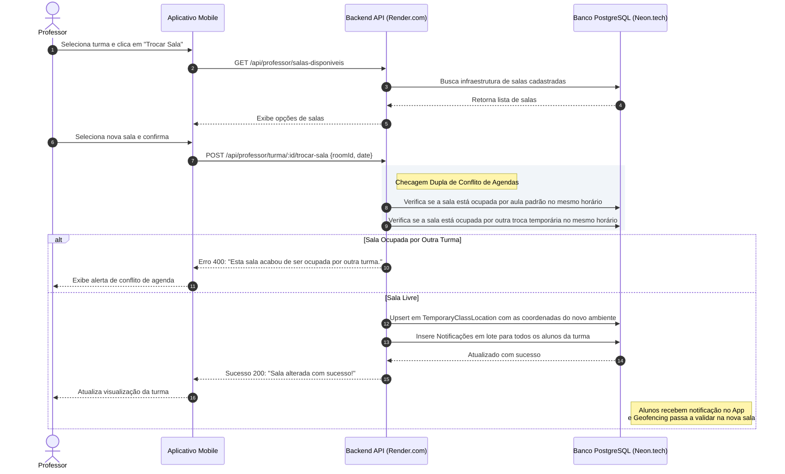

---

### 2.3 Chamada Manual & Lançamento de Aula Remota (EAD)
Permite o lançamento de presença/falta para aulas ministradas à distância ou em situações onde a chamada por GPS é dispensada pelo docente.

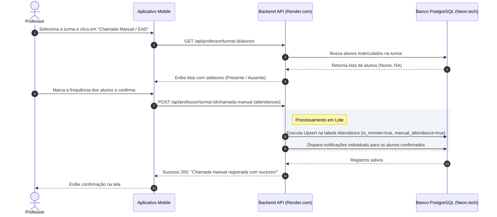

---

### 2.4 Reset de Vínculo de Dispositivo (Device Binding Reset)
Permite ao professor desvincular o `Device ID` de um aluno em caso de troca de aparelho ou imprevisto tecnológico durante a aula.

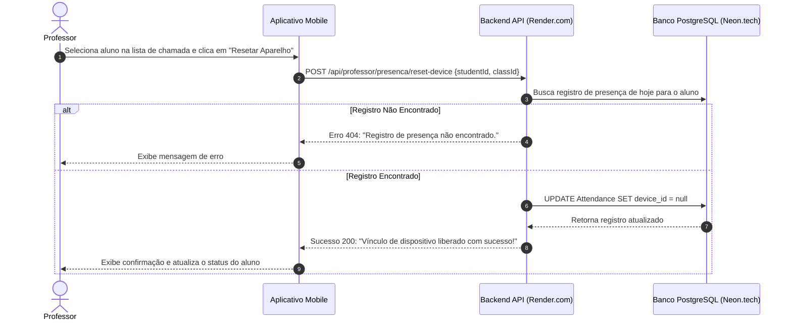

---

## 3. Fluxos do Coordenador

Mapeia a gestão administrativa da instituição: análise de semestres letivos, identificação de alunos em risco de evasão, cadastro de infraestrutura de salas, matriculação de alunos e exportação de relatórios.

### 3.1 Dashboard de Semestres & Análise de Alunos em Risco de Evasão
Permite ao coordenador visualizar a taxa geral de ausências por semestre e identificar alunos com alto índice de faltas (`< 75%` de presença).

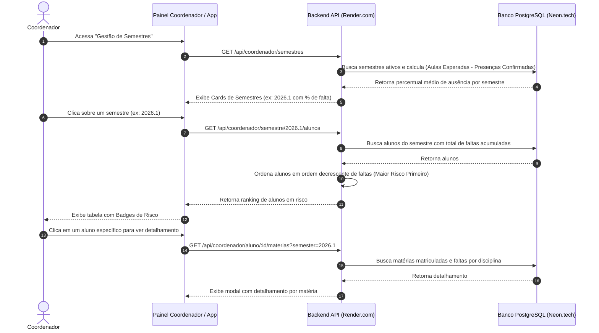

---

### 3.2 Cadastro de Infraestrutura de Salas e Turmas
Permite cadastrar novas salas físicas no campus (centróides GPS) e opcionalmente criar disciplinas vinculando-as a um professor responsável.

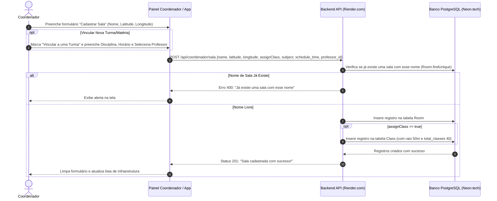

---

### 3.3 Matrícula de Alunos em Disciplinas
Permite ao coordenador vincular um aluno cadastrado no sistema a uma disciplina/turma ativa no semestre.

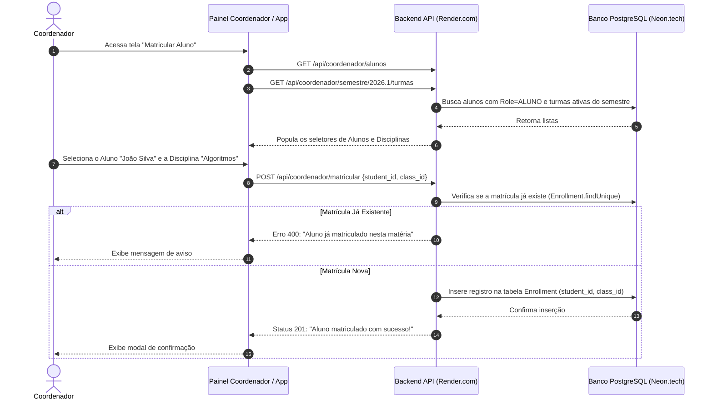

---

### 3.4 Geração e Exportação de Relatórios Gerenciais (PDF & XLSX)
Permite a extração de relatórios analíticos em formatos consolidados com suporte a gráficos e detalhamento acadêmico.

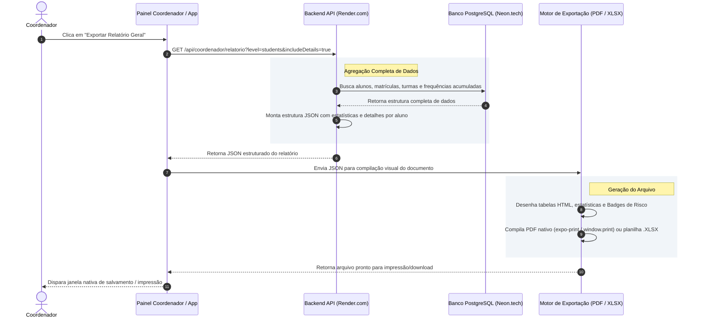

---

## 4. Fluxos de Infraestrutura & Jobs Autônomos

Mapeia as tarefas agendadas em segundo plano que garantem o funcionamento ininterrupto, a segurança e a conformidade legal do **GeoClass**.

### 4.1 Cron Job LGPD (Expurgo Diário de Geodados às 03:00 AM)
Garante a conformidade com a LGPD (*Privacy by Design*) através da anonimização de coordenadas e identificadores físicos de chamadas com mais de 6 meses.

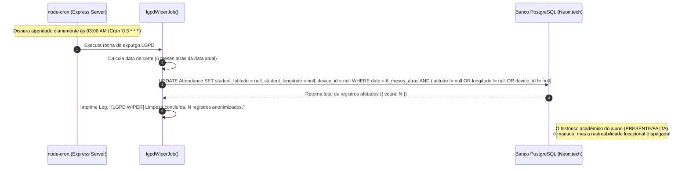

---

### 4.2 Cron Job de Notificações Automáticas (Processamento Minutual)
Varre continuamente as aulas agendadas e cria notificações proativas para os alunos.

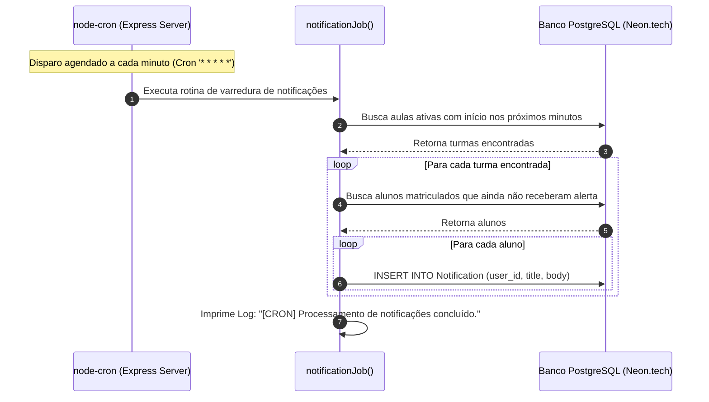

---

### 4.3 Keep-Alive Anti-Hibernação (Pinger UptimeRobot)
Impede o *spin-down* do container no plano gratuito do Render.com através de requisições HTTP periódicas.

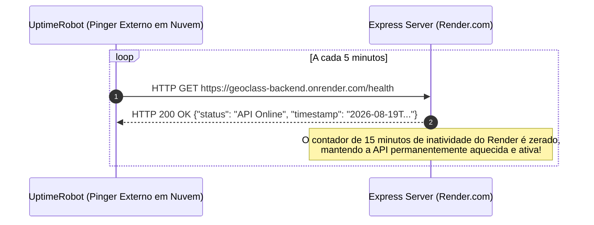
