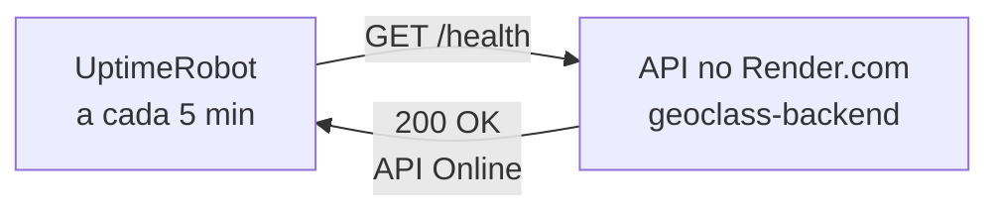

# Guia de Configuração: Keep-Alive da API no Render com UptimeRobot

Este guia detalha o passo a passo para configurar o serviço gratuito **UptimeRobot** a fim de evitar que a API do GeoClass hospedada no **Render.com** entre em estado de hibernação (*spin down*).

---

## 📌 Contexto do Problema (Hibernação no Render Free Tier)

No plano gratuito do Render, qualquer serviço da Web (Web Service) entra automaticamente em hibernação se passar mais de **15 minutos** sem receber requisições HTTP.

* **Consequência para os Usuários:** Quando um aluno ou professor tenta abrir o aplicativo após um período de inatividade, o primeiro acesso pode demorar entre **30 a 50 segundos** enquanto o servidor "acorda".
* **Solução:** Configurar um pinger automático de 5 em 5 minutos apontando para a rota de healthcheck (`/health`) da API.

---

## 🏗️ Fluxo da Solução



Com esse fluxo, o contador de 15 minutos de inatividade do Render é constantemente reiniciado, mantendo a API **sempre ativa e pronta para resposta rápida**.

---

## 🚀 Passo a Passo de Configuração no UptimeRobot

### Passo 1: Criar Conta no UptimeRobot
1. Acesse o site oficial: [uptimerobot.com](https://uptimerobot.com/).
2. Clique em **Register for FREE** no canto superior direito.
3. Preencha seus dados de cadastro (ou utilize o login social com Google/GitHub).
4. Se solicitado, confirme o e-mail de ativação da conta.

---

### Passo 2: Adicionar o Monitor de Keep-Alive
1. Após acessar o painel principal (*Dashboard*), clique no botão verde **+ Add New Monitor** (canto superior esquerdo).
2. Preencha os campos conforme a tabela abaixo:

| Campo | Valor a Preencher | Explicação |
| :--- | :--- | :--- |
| **Monitor Type** | `HTTP(s)` | Tipo de monitoramento via requisição web padrão. |
| **Friendly Name** | `GeoClass API Keep-Alive` | Nome amigável de identificação do monitor. |
| **URL (or IP)** | `https://geoclass-backend.onrender.com/health` | **CRÍTICO:** URL pública da API com o endpoint `/health` no final. |
| **Monitoring Interval** | `Every 5 minutes` | Frequência de pings (máximo permitido no plano gratuito do UptimeRobot). |

3. As demais configurações avançadas podem permanecer no padrão.
4. Role até o final da página e clique no botão verde **Create Monitor**.

---

### Passo 3: Verificação e Monitoramento

1. O monitor passará a listar no painel com o status **Up (Verde)**.
2. Você pode clicar no nome do monitor para visualizar o gráfico de tempo de resposta e o histórico de requisições.
3. Para validar que a rota está respondendo corretamente, acesse no navegador ou via terminal:
   ```bash
   curl -s https://geoclass-backend.onrender.com/health
   ```
   **Resposta esperada:**
   ```json
   {
     "status": "API Online",
     "timestamp": "2026-08-06T17:44:15.864Z"
   }
   ```

---

## ❓ Por que usar a rota `/health` e não a raiz (`/`)?

A rota `/health` foi implementada especificamente no arquivo `src/server.ts` do backend para retornar um código de status HTTP `200 OK`. 

Se o monitoramento apontar para a raiz `https://geoclass-backend.onrender.com`, o Express retornará `404 Not Found` (já que a raiz não possui handler configurado). Embora um retorno 404 também acorda o servidor, o UptimeRobot sinalizará o monitor com alerta vermelho de falha.

---

## 📊 Resumo das Vantagens

* **Custo Zero:** 100% gratuito no plano básico do UptimeRobot (suporta até 50 monitores).
* **Zero Spin Down:** A API do GeoClass estará sempre aquecida e pronta para atender os alunos e professores em sala de aula sem lentidão inicial.
* **Alertas de Queda:** Se por algum motivo o Render ou o Neon ficarem fora do ar, o UptimeRobot enviará uma notificação por e-mail automaticamente.
